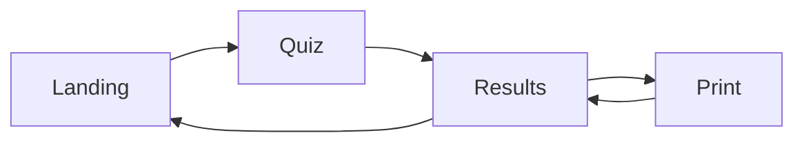

## Overview

The RAADS-R Self-Host application is built with **React 19** and **TypeScript**, using a component-based architecture with custom hooks for state management. The application follows a single-page application (SPA) pattern with client-side routing through screen state.

## Application Structure

```
src/
├── App.tsx                 # Root component with screen routing
├── data/
│   ├── dataset.json        # RAADS-R question and domain data
│   └── dataset.schema.ts   # TypeScript type definitions
├── engine/
│   ├── scoring.ts          # Primary scoring algorithm
│   └── scoring-alt.ts      # Alternative scoring for validation
├── hooks/
│   ├── useQuizState.ts     # Quiz state management (211 lines)
│   ├── useDarkMode.ts      # Dark mode toggle and persistence
│   └── useLocalStorage.ts  # Generic localStorage hook
├── components/             # 12 React components
│   ├── Landing.tsx
│   ├── Quiz.tsx
│   ├── Results.tsx
│   ├── PrintView.tsx
│   ├── QuestionCard.tsx
│   ├── ProgressBar.tsx
│   ├── DomainBar.tsx
│   ├── DarkModeToggle.tsx
│   ├── PrivacyBanner.tsx
│   ├── ExportButtons.tsx
│   ├── DeleteData.tsx
│   └── HowScoringWorks.tsx
└── __tests__/
    ├── scoring.test.ts     # Scoring engine tests (270 lines)
    └── dataset.test.ts     # Dataset validation tests (151 lines)
```

## Core Hooks

### useQuizState

The primary state management hook for the entire quiz experience.

```typescript useQuizState.ts:35
export function useQuizState(dataset: Dataset) {
  const saved = useMemo(() => loadState(), []);
  const canPersist = saved?.consentGiven === true;

  const [screen, setScreen] = useState<QuizScreen>(
    canPersist && saved?.screen ? saved.screen : 'landing',
  );
  const [currentQuestion, setCurrentQuestion] = useState(
    canPersist && saved?.currentQuestion ? saved.currentQuestion : 0,
  );
  const [responses, setResponses] = useState<Responses>(
    canPersist && saved?.responses ? saved.responses : {},
  );
  const [consentGiven, setConsentGiven] = useState<boolean | null>(
    saved?.consentGiven ?? null,
  );
  
  // ... state management logic
}
```

<ParamField path="dataset" type="Dataset" required>
  The RAADS-R dataset containing all questions and domain metadata
</ParamField>

**State Variables:**

<ResponseField name="screen" type="QuizScreen">
  Current screen: `'landing'`, `'quiz'`, `'results'`, or `'print'`
</ResponseField>

<ResponseField name="currentQuestion" type="number">
  Zero-based index of the current question (0-79)
</ResponseField>

<ResponseField name="responses" type="Responses">
  User responses keyed by item ID
</ResponseField>

<ResponseField name="consentGiven" type="boolean | null">
  Privacy consent status: `true` (accepted), `false` (declined), `null` (not asked)
</ResponseField>

**Returned API:**

```typescript useQuizState.ts:188
return {
  screen,
  currentQuestion,
  currentItem,        // Current question item
  currentDomain,      // Current domain metadata
  responses,
  results,            // Computed results (null if incomplete)
  totalQuestions,     // 80
  answeredCount,      // Number of answered questions
  allAnswered,        // true if all 80 answered
  consentGiven,
  answer,             // (itemId, value) => void
  nextQuestion,       // () => void
  prevQuestion,       // () => void
  goToQuestion,       // (index) => void
  startQuiz,          // () => void
  finishQuiz,         // () => void
  retake,             // () => void
  deleteAllData,      // () => void
  giveConsent,        // (consent) => void
  goToScreen,         // (screen) => void
};
```

**State Persistence:**

<Note>
  State is persisted to `localStorage` under key `'vibe-check-state'` **only if** the user has given consent. The hook uses refs to avoid stale closures in callbacks.
</Note>

```typescript useQuizState.ts:52
// Refs to avoid stale closures in callbacks
const screenRef = useRef(screen);
const questionRef = useRef(currentQuestion);
const responsesRef = useRef(responses);
const consentRef = useRef(consentGiven);

useEffect(() => { screenRef.current = screen; }, [screen]);
useEffect(() => { questionRef.current = currentQuestion; }, [currentQuestion]);
useEffect(() => { responsesRef.current = responses; }, [responses]);
useEffect(() => { consentRef.current = consentGiven; }, [consentGiven]);
```

**Results Computation:**

Results are computed on-demand using `useMemo` when all questions are answered:

```typescript useQuizState.ts:174
const results: Results | null = useMemo(() => {
  const answered = Object.keys(responses).length;
  if (answered < totalQuestions) return null;
  return computeResults(responses, dataset);
}, [responses, totalQuestions, dataset]);
```

### useDarkMode

Manages dark mode state with system preference detection and persistence.

```typescript useDarkMode.ts:4
export function useDarkMode() {
  const prefersDark =
    typeof window !== 'undefined' && window.matchMedia('(prefers-color-scheme: dark)').matches;

  const [isDark, setIsDark] = useLocalStorage('vibe-check-dark-mode', prefersDark);

  useEffect(() => {
    document.documentElement.classList.toggle('dark', isDark);
  }, [isDark]);

  const toggle = useCallback(() => {
    setIsDark((prev: boolean) => !prev);
  }, [setIsDark]);

  return { isDark, toggle };
}
```

**Features:**
- Detects system dark mode preference on first load
- Persists user preference to `localStorage`
- Applies `.dark` class to `<html>` element for Tailwind CSS
- Returns `{ isDark, toggle }` API

### useLocalStorage

Generic hook for syncing state with localStorage.

```typescript useLocalStorage.ts:3
export function useLocalStorage<T>(key: string, initialValue: T) {
  const [storedValue, setStoredValue] = useState<T>(() => {
    try {
      const item = window.localStorage.getItem(key);
      return item ? (JSON.parse(item) as T) : initialValue;
    } catch {
      return initialValue;
    }
  });

  const setValue = useCallback(
    (value: T | ((val: T) => T)) => {
      const valueToStore = value instanceof Function ? value(storedValue) : value;
      setStoredValue(valueToStore);
      try {
        window.localStorage.setItem(key, JSON.stringify(valueToStore));
      } catch {
        // localStorage full or unavailable
      }
    },
    [key, storedValue],
  );

  const removeValue = useCallback(() => {
    setStoredValue(initialValue);
    try {
      window.localStorage.removeItem(key);
    } catch {
      // ignore
    }
  }, [key, initialValue]);

  return [storedValue, setValue, removeValue] as const;
}
```

**API:**
- `storedValue`: Current value
- `setValue`: Update value (supports updater function)
- `removeValue`: Delete from localStorage and reset to initial value

**Type Safety:**
The hook is fully generic and maintains type safety through TypeScript inference:

```typescript
const [isDark, setIsDark] = useLocalStorage('dark-mode', false);
// isDark: boolean
// setIsDark: (value: boolean | ((val: boolean) => boolean)) => void
```

## Component Architecture

### App Component

Root component implementing screen-based routing:

```typescript App.tsx:14
function App() {
  const { isDark, toggle: toggleDark } = useDarkMode();
  const quiz = useQuizState(typedDataset);

  return (
    <div className="min-h-screen bg-surface-light dark:bg-surface-dark text-text-light dark:text-text-dark transition-colors duration-300">
      <a href="#main-content" className="sr-only focus:not-sr-only ...">
        Skip to main content
      </a>

      <DarkModeToggle isDark={isDark} onToggle={toggleDark} />

      <main id="main-content">
        {quiz.screen === 'landing' && (
          <Landing onStart={quiz.startQuiz} />
        )}

        {quiz.screen === 'quiz' && quiz.currentItem && (
          <Quiz
            items={typedDataset.items}
            currentQuestion={quiz.currentQuestion}
            responses={quiz.responses}
            totalQuestions={quiz.totalQuestions}
            currentItem={quiz.currentItem}
            onAnswer={quiz.answer}
            onNext={quiz.nextQuestion}
            onPrev={quiz.prevQuestion}
            onFinish={quiz.finishQuiz}
            onHome={() => quiz.goToScreen('landing')}
            allAnswered={quiz.allAnswered}
          />
        )}

        {quiz.screen === 'results' && quiz.results && (
          <Results
            results={quiz.results}
            responses={quiz.responses}
            dataset={typedDataset}
            onRetake={quiz.retake}
            onDelete={quiz.deleteAllData}
            onPrint={() => quiz.goToScreen('print')}
          />
        />
        )}

        {quiz.screen === 'print' && quiz.results && (
          <PrintView
            results={quiz.results}
            responses={quiz.responses}
            dataset={typedDataset}
            onBack={() => quiz.goToScreen('results')}
          />
        )}
      </main>

      {quiz.consentGiven === null && quiz.screen !== 'landing' && (
        <PrivacyBanner
          onAccept={() => quiz.giveConsent(true)}
          onDecline={() => quiz.giveConsent(false)}
        />
      )}
    </div>
  );
}
```

**Screen Flow:**



### Component Responsibilities

<Tabs>
  <Tab title="Screen Components">
    - **Landing**: Welcome screen with quiz introduction
    - **Quiz**: Question-by-question interface with navigation
    - **Results**: Score display with domain breakdown
    - **PrintView**: Print-optimized results layout
  </Tab>
  <Tab title="UI Components">
    - **QuestionCard**: Individual question with response options
    - **ProgressBar**: Visual progress indicator
    - **DomainBar**: Domain score visualization
    - **ExportButtons**: PDF/print/share actions
  </Tab>
  <Tab title="Utility Components">
    - **DarkModeToggle**: Theme switcher button
    - **PrivacyBanner**: GDPR-style consent banner
    - **DeleteData**: Data deletion confirmation
    - **HowScoringWorks**: Scoring methodology explainer
  </Tab>
</Tabs>

## State Management Pattern

The application uses a **unidirectional data flow** pattern:

1. **Single Source of Truth**: `useQuizState` hook manages all quiz state
2. **Prop Drilling**: State and callbacks passed down to components
3. **No Global State**: No Redux, Zustand, or Context (except for dark mode)
4. **Optimistic Updates**: Immediate UI feedback with localStorage persistence
5. **Computed Derived State**: Results computed via `useMemo` when dependencies change

<Warning>
  The application does **not** use React Router. Screen navigation is handled through the `screen` state variable in `useQuizState`.
</Warning>

## Accessibility Features

```typescript App.tsx:20
{/* Skip link for accessibility */}
<a
  href="#main-content"
  className="sr-only focus:not-sr-only focus:absolute focus:top-4 focus:left-4 focus:z-50 focus:px-4 focus:py-2 focus:bg-clinical-blue focus:text-white focus:rounded"
>
  Skip to main content
</a>
```

- **Skip Link**: Keyboard users can skip to main content
- **Semantic HTML**: `<main>`, `<button>`, proper heading hierarchy
- **Focus Management**: Visible focus indicators
- **ARIA Labels**: Screen reader support (component-specific)

## Styling Approach

- **Tailwind CSS**: Utility-first CSS framework
- **Dark Mode**: Class-based dark mode (`.dark` on `<html>`)
- **Custom Theme**: Clinical color palette with CSS variables
- **Responsive Design**: Mobile-first responsive breakpoints

## Performance Optimizations

<Note>
  - `useMemo` for expensive computations (results calculation)
  - `useCallback` for stable function references
  - `useRef` to avoid stale closures
  - Lazy loading of screens through conditional rendering
  - No external API calls (static dataset)
</Note>

## Implementation Files

- **Root Component**: `src/App.tsx`
- **State Hook**: `src/hooks/useQuizState.ts`
- **Dark Mode Hook**: `src/hooks/useDarkMode.ts`
- **Storage Hook**: `src/hooks/useLocalStorage.ts`
- **Components**: `src/components/*.tsx` (12 files)
